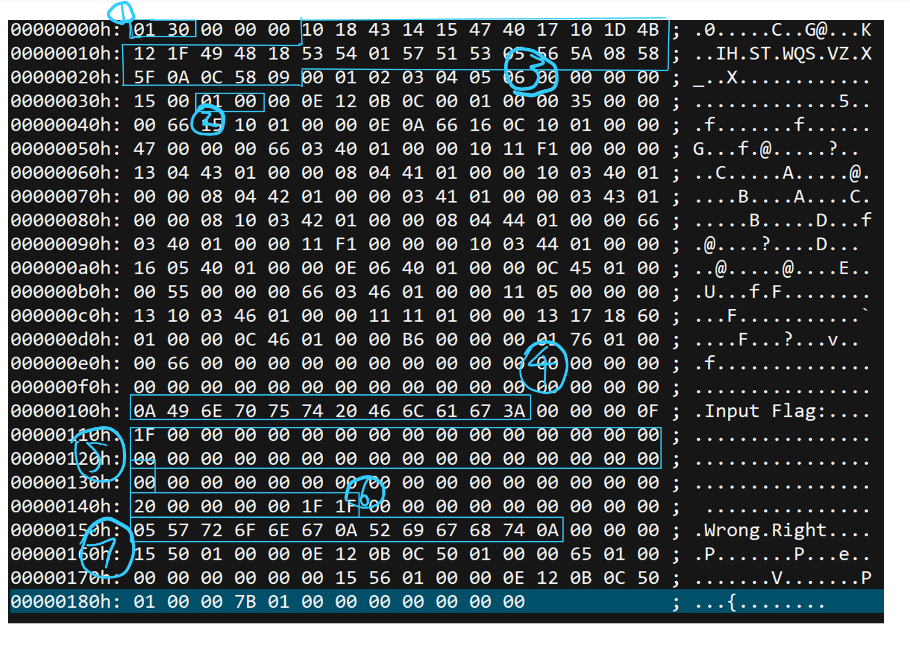

# babyvm
## Author: 文火
&nbsp;&nbsp;&nbsp;&nbsp;<font size=2>题目给了两个文件，其中vm_rel从p.bin读取数据作为程序的流程,我分析了一下然后得到了其大致的原理:</font>
</br>
  
<font size=2>
1.初始偏移，程序从这里开始寻址到0x31。</br>
2.从0x31取了一个DWORD，也就是0x100，这是 “Input flag:” 提示的偏移。</br>
3.存放待比较的密文。</br>
4.程序开头输出的字符串。</br>
5.存放输入的偏移。</br>
6.基数与临时空间。</br>
7.正确或错误输出的字符串。</br></br></font>
&nbsp;&nbsp;&nbsp;&nbsp;<font size=2>首先，从[0x1]取得0x30然后自增，这时候从0x31到0x34得到一个像起始数之类的东西然后放到c+4的位置，我把c看成是一个**存放临时数据的空间，8字节大小**。</font></br>
&nbsp;&nbsp;&nbsp;&nbsp;<font size=2>然后再用这个‘起始数’作为偏移得到了0x100处的数据，这是存放”Input Flag:”字符串的位置，这个位置以这个字符串的大小作为第一个元素（程序根据递减第一个元素来判断是否输出完毕）。</font></br>
&nbsp;&nbsp;&nbsp;&nbsp;<font size=2>（__int64）c这个临时空间的低4字节会存放待输出的单字符，高4字节存放索引。
所以输出完了之后，[c+4]是0x110,[c]是0x3a(‘:’)。
</font></br>
&nbsp;&nbsp;&nbsp;&nbsp;<font size=2>然后程序就会要求我们输入，存放在在内存的0x603360处（相当于文件的0x110处）。同样的，第一个元素是字符串大小，紧随其后是我们输入的字符串。在这里0x603360（文件中是0x110）会随着输入递减，所以相当于：
</font></br>
```C
for(int i=0x1F;i>=0;i--)
  getchar()；
```
&nbsp;&nbsp;&nbsp;&nbsp;<font size=2>所以一共接受了32个字符。完了之后最后一个输入被存放在0x603380(文件中0x130)，同时这个时候临时空间c中的高位也存着0x130。
</font></br>
&nbsp;&nbsp;&nbsp;&nbsp;<font size=2>**然后程序会循环以下操作直到加密完输入中的所有的字符：**
</font></br>
&nbsp;&nbsp;&nbsp;&nbsp;<font size=2>从文件中的 [0x56]得到偏移0x140，又以这个偏移( [0x140])得到了一个基数(0x20)
把这个基数放在了临时空间c的高低4字节。
</font></br>
&nbsp;&nbsp;&nbsp;&nbsp;<font size=2>然后又从文件偏移0x5c处得到0x1f（也就是输入的次数）加在了c的低4字节。
所以这个时候c的低4字节应该是0x111，正好是我们输入的字符的头字符 ：）
</font></br>
&nbsp;&nbsp;&nbsp;&nbsp;<font size=2>然后把这一个字符放到c的低4位，然后从文件偏移0x62处得到偏移0x143（其实也是一个临时存放地点），并开始加密。我还原了加密的等价步骤：
</font></br>
```C
unsigned char string[]= "\x61\x61\x61\x61\x61\x61\x61\x61"
			"\x61\x61\x61\x61\x61\x61\x61\x61"
			"\x61\x61\x61\x61\x61\x61\x61\x61"
			"\x61\x61\x61\x61\x61\x61\x61\x61\x00";
	unsigned int count,temp1,temp2,temp4,a1,a2;
	unsigned char* ch=string;
	count=0x20;				//基数
	while(*ch)
	{
		
		a1=~(*ch&count);
		temp1=unsigned char(a1);
		
		a2=a1;
		a1=~(count&a2);
		temp2=(unsigned char)a1;
		a1=~(a2&*ch);
		
		a2=a1;
		a1=0xffffff00+temp2;
		a1=~(a1&a2);
		temp4=(unsigned char)a1;
		ch++;
		count++;
		printf("%x\n",temp4);
	}

```
&nbsp;&nbsp;&nbsp;&nbsp;<font size=2>具体加密的步骤大概就是这样，不展开讲了，所以完了之后c临时空间的高4字节是0x130,低4字节是0x5e（也就是加密了最后一个输入字节的数据）。这是我输入的测试数据‘a’的加密：），这个时候基数是0x40。
</font></br>
&nbsp;&nbsp;&nbsp;&nbsp;<font size=2>所以我们继续吧，感觉离flag不远了：）
</font></br>
&nbsp;&nbsp;&nbsp;&nbsp;<font size=2>然后程序从文件偏移0xb7得到偏移0x145,再从这个偏移得到0x1f放在了c的低4字节。
</font></br>
&nbsp;&nbsp;&nbsp;&nbsp;<font size=2>再从偏移0xbc得到5加到c低4字节，然后这时候上面的数据是0x24,再以0x24作为文件偏移得到数据9放在c低4字节，又放了一次高4字节。
</font></br>
&nbsp;&nbsp;&nbsp;&nbsp;<font size=2>从0xc3得到偏移0x146，再从0x146文件偏移得到0x1f放在c低4字节，
从0xc8得到偏移0x111加到c低字节（也就是**寻址到了我们之前输入的被加密了的数据的最后一位！），
然后把他放在了c的低4字节，计算[c]-[c+4]，如果结果不是0的话，程序就像输入 “Input Flag:” 一样输出 ”Wrong!” 这下你知道怎么做了吧：）**
</font></br></br>

&nbsp;&nbsp;&nbsp;&nbsp;<font size=2>我们把我们测试数据的最后一位密文0x5e置9,绕过了第一次检测之后，我们发现程序又从偏移0xd4得到偏移0x146，又从这得到0x1f，又是一个counter！作为对照的次数，然后从0xd8得到偏移0xb6,把自减后的counter放在[c],然后从偏移0xbc得到5加到[c]，这个时候是0x23,把它作为索引得到下一个密文再进行我们最后一位上一位的加密的密文的对比，显然，**密文被藏在了0x5~0x24处**！ 我们成功了：）
</font></br>
&nbsp;&nbsp;&nbsp;&nbsp;<font size=2>然后我们就可以根据我之前还原的加密进行爆破得到正确的输入，下面是脚本：
</font></br>

```C
#include <stdio.h>


int main()
{
	unsigned char key_string[]= 	"\x10\x18\x43\x14\x15\x47\x40\x17"
					"\x10\x1D\x4B\x12\x1F\x49\x48\x18"
					"\x53\x54\x01\x57\x51\x53\x05\x56"
					"\x5A\x08\x58\x5F\x0A\x0C\x58\x09\x00";
	unsigned int count,temp1,temp2,temp4,a1,a2;
	unsigned char ch=0x20;
	unsigned char*ptr=key_string;
	count=0x20;
	while(1)
	{
		
		a1=~(ch&count);
		temp1=unsigned char(a1);
		
		a2=a1;
		a1=~(count&a2);
		temp2=(unsigned char)a1;
		a1=~(a2&ch);
		
		a2=a1;
		a1=0xffffff00+temp2;
		a1=~(a1&a2);
		temp4=(unsigned char)a1;
		if(temp4!=*ptr)
			ch++;
		else
		{
			printf("%c",ch);
			ch=0x20;
			ptr++;
			count++;
			
			//break;
			if(!(*ptr))
				break;
		}
	}
	//瞬间得到flag:09a71bf084a93df7ce3def3ab1bd61f6
	return 0;
}

```

