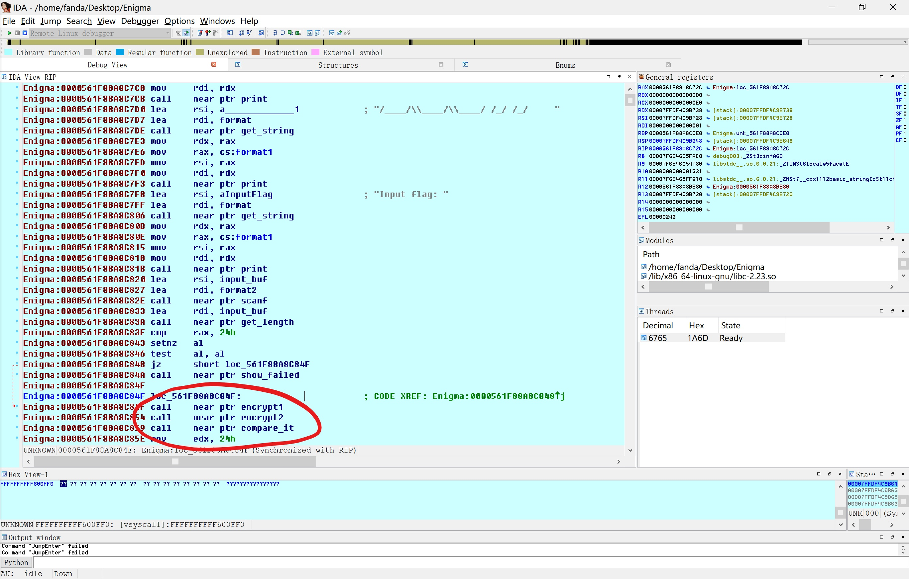
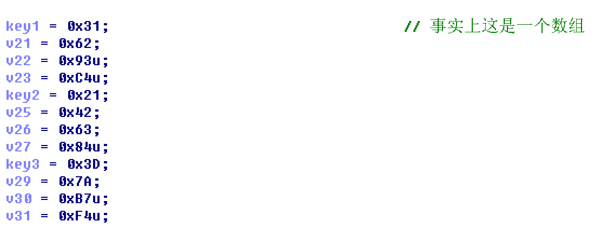

# SUCTF2018 Enigma
## Author: fanda
</br>
</br>

>君子泰而不骄，小人骄而不泰。

</br>
&nbsp;&nbsp;&nbsp;&nbsp;<font size=2>用IDA打开发现是用了C++类的一些函数，不是那么容易看出来各个函数的作用，没事，我们用IDA远程调试到Linux动态调试看看。</font></br>

```C++
__int64 __fastcall main(__int64 a1, char **a2, char **a3)
{
  __int64 v3; // rax@1
  __int64 v4; // rdx@1
  __int64 v5; // rax@1
  __int64 v6; // rdx@1
  __int64 v7; // rax@1
  __int64 v8; // rdx@1
  __int64 v9; // rax@1
  __int64 v10; // rdx@1
  __int64 v11; // rax@1
  __int64 v12; // rdx@1
  __int64 v13; // rax@1
  __int64 input_size; // rax@1
  __int64 v15; // rdx@1
  __int64 v16; // rdx@3
  __int64 v17; // rax@5

  LODWORD(v3) = std::operator<<<std::char_traits<char>>(&std::cout, "   _____ __  ____________________", a3);
  std::ostream::operator<<(v3, &std::endl<char,std::char_traits<char>>);
  LODWORD(v5) = std::operator<<<std::char_traits<char>>(&std::cout, "  / ___// / / / ____/_  __/ ____/", v4);
  std::ostream::operator<<(v5, &std::endl<char,std::char_traits<char>>);
  LODWORD(v7) = std::operator<<<std::char_traits<char>>(&std::cout, "  \\__ \\/ / / / /     / / / /_  ", v6);
  std::ostream::operator<<(v7, &std::endl<char,std::char_traits<char>>);
  LODWORD(v9) = std::operator<<<std::char_traits<char>>(&std::cout, " ___/ / /_/ / /___  / / / __/    ", v8);
  std::ostream::operator<<(v9, &std::endl<char,std::char_traits<char>>);
  LODWORD(v11) = std::operator<<<std::char_traits<char>>(&std::cout, "/____/\\____/\\____/ /_/ /_/     ", v10);
  std::ostream::operator<<(v11, &std::endl<char,std::char_traits<char>>);
  LODWORD(v13) = std::operator<<<std::char_traits<char>>(&std::cout, "Input flag: ", v12);
  std::ostream::operator<<(v13, &std::endl<char,std::char_traits<char>>);
  std::operator>><char,std::char_traits<char>,std::allocator<char>>(&std::cin, &input);
  LODWORD(input_size) = get_length(&input);
  if ( input_size != 36 )
    show_failed((__int64)&input, (__int64)&input, v15);
  make_input_key();
  next_make();
  or_the_inputkey();
  if ( memcmp(input2key, &key_table, 0x24uLL) )
    show_failed((__int64)input2key, (__int64)&key_table, v16);
  LODWORD(v17) = std::operator<<<std::char_traits<char>>(&std::cout, "200 OK!", v16);
  std::ostream::operator<<(v17, &std::endl<char,std::char_traits<char>>);
  return 0LL;
}
```

&nbsp;&nbsp;&nbsp;&nbsp;<font size=2>通过动态调试了之后，可以猜测出一些函数的作用并命名之（虽然不调试基本也能猜个差不多:P），程序先接收我们的输入，如果不是36个字符就退出，然后接下来的三个函数分别进行加密和判断正确：</font></br>



&nbsp;&nbsp;&nbsp;&nbsp;<font size=2>从第一个函数开始分析，每一轮8次循环都是对输入的字符的每一个比特位进行检查然后进行加工。每次都会把字符或者key放在一个临时变量的低8位，然后高8位放检查的比特位位置。我在这里把他们看成了结构体。流程如下，根据我的命名看懂应该不难:)</font></br>

```C++
for ( j = 0; j <= 7; ++j )
    {
      pre_flag = flag1;
      set_struct((__int64)&struct1, (__int64)&step_key, j);// set_struct:
                                                // *struct=arg2
                                                // *(struct+8)=arg3
      check_each_key_bit = check_bit((__int64)&struct1);// check every bit of ch
      set_struct((__int64)&struct2, (__int64)&input_ptr, j);
      check_each_input_bit = check_bit((__int64)&struct2);
      set_flags(check_each_input_bit, check_each_key_bit, pre_flag, &flag1, &flag2);
      nop2();
      nop2();
      set_or_unset = flag2 != 0;
      set_struct((__int64)&struct3, (__int64)&input_ptr, j);
      set_bit((__int64)&struct3, set_or_unset);
      nop2();
    }
    fetch_it((__int64)&temp_key2, (unsigned __int8)*(&key2 + key_i));
    step_key = temp_key2;
    for ( k = 0; k <= 7; ++k )
    {
      pre_flag1 = flag1;
      set_struct((__int64)&v36, (__int64)&step_key, k);
      v9 = check_bit((__int64)&v36);
      set_struct((__int64)&v37, (__int64)&input_ptr, k);
      v10 = check_bit((__int64)&v37);
      set_flags(v10, v9, pre_flag1, &flag1, &flag2);
      nop2();
      nop2();
      v11 = flag2 != 0;
      set_struct((__int64)&v38, (__int64)&input_ptr, k);
      set_bit((__int64)&v38, v11);
      nop2();
    }
    fetch_it((__int64)&v39, (unsigned __int8)*(&key3 + key_j));
    step_key = v39;
    for ( l = 0; l <= 7; ++l )
    {
      pre_flag2 = flag1;
      set_struct((__int64)&v40, (__int64)&step_key, l);
      v13 = check_bit((__int64)&v40);
      set_struct((__int64)&v41, (__int64)&input_ptr, l);
      v14 = check_bit((__int64)&v41);
      set_flags(v14, v13, pre_flag2, &flag1, &flag2);
      nop2();
      nop2();
      v15 = flag2 != 0;
      set_struct((__int64)&v42, (__int64)&input_ptr, l);
      set_bit((__int64)&v42, v15);
      nop2();
    }
```

&nbsp;&nbsp;&nbsp;&nbsp;<font size=2>这个函数里面一共有三轮加密，每次都用不一样的key，我根据这个地址命名为了key1,key2,key3。</font></br>



```C++
//就像这样
key1[] = {0x31,0x62,0x93,0xC4};
key2[] = {0x21,0x42,0x63,0x84};
key3[] = {0x3D,0x7A,0xB7,0xF4};
```

&nbsp;&nbsp;&nbsp;&nbsp;<font size=2>具体用key的哪一个字节根据当时处理的字节的位置。</font></br>

```C++
if ( ++key_count == 4 )
    {
      key_count = 0;
      ++key_i;                                  // key=*(&key1+key_i)
    }
    if ( key_i == 4 )
    {
      key_i = 0;
      ++key_j;                                  // key=*(&key2+key_j)
    }
    if ( key_j == 4 )
      key_j = 0;
```

&nbsp;&nbsp;&nbsp;&nbsp;<font size=2>这三轮加密都差不多，其实就是key不一样而已，根据输入的字节必须为36位，所以key3的最后一个字节其实永远不会用到:D，三轮加密完了就把这个字节存起来。
</font></br>
&nbsp;&nbsp;&nbsp;&nbsp;<font size=2>然后我们回退，跟进到第二个加密函数分析分析，这个函数比较简单，逐个取出之前第一次加密完的字节再进行加工，然后再放回去。不多解释了，看懂了第一个函数后看懂这个不难。</font></br>

```C++
void next_make()
{
  bool v0; // bl@5
  bool v1; // bl@5
  bool v2; // bl@5
  bool v3; // bl@5
  bool v4; // bl@5
  bool v5; // bl@5
  char v6; // cl@6
  __int64 input_key_ptr; // [sp+0h] [bp-C0h]@1
  __int64 input_key_ch; // [sp+8h] [bp-B8h]@3
  char v9; // [sp+10h] [bp-B0h]@5
  char v10; // [sp+20h] [bp-A0h]@5
  char v11; // [sp+30h] [bp-90h]@5
  char v12; // [sp+40h] [bp-80h]@5
  char v13; // [sp+50h] [bp-70h]@5
  char v14; // [sp+60h] [bp-60h]@5
  char v15; // [sp+70h] [bp-50h]@5
  char v16; // [sp+80h] [bp-40h]@5
  char v17; // [sp+90h] [bp-30h]@5
  int j; // [sp+A8h] [bp-18h]@3
  int i; // [sp+ACh] [bp-14h]@1

  input_key_ptr = 0LL;
  for ( i = 0; i <= 35; ++i )
  {
    fetch_it((__int64)&input_key_ch, input2key[i]);
    input_key_ptr = input_key_ch;
    for ( j = 0; j <= 2; ++j )
    {
      set_struct((__int64)&v9, (__int64)&input_key_ptr, j);
      v0 = check_bit((__int64)&v9);
      set_struct((__int64)&v10, (__int64)&input_key_ptr, 7 - j);
      v1 = v0 != check_bit((__int64)&v10);
      set_struct((__int64)&v11, (__int64)&input_key_ptr, j);
      set_bit((__int64)&v11, v1);
      nop2();
      nop2();
      nop2();
      set_struct((__int64)&v12, (__int64)&input_key_ptr, 7 - j);
      v2 = check_bit((__int64)&v12);
      set_struct((__int64)&v13, (__int64)&input_key_ptr, j);
      v3 = v2 != check_bit((__int64)&v13);
      set_struct((__int64)&v14, (__int64)&input_key_ptr, 7 - j);
      set_bit((__int64)&v14, v3);
      nop2();
      nop2();
      nop2();
      set_struct((__int64)&v15, (__int64)&input_key_ptr, j);
      v4 = check_bit((__int64)&v15);
      set_struct((__int64)&v16, (__int64)&input_key_ptr, 7 - j);
      v5 = v4 != check_bit((__int64)&v16);
      set_struct((__int64)&v17, (__int64)&input_key_ptr, j);
      set_bit((__int64)&v17, v5);
      nop2();
      nop2();
      nop2();
    }
    v6 = return_arg_((__int64)&input_key_ptr);
    input2key[i] = v6;
  }
}
```

&nbsp;&nbsp;&nbsp;&nbsp;<font size=2>这些加密完了就要开始比较密文了，第三个函数也不复杂，但是里面也有一个加密函数，根据内存中的一个seed（在这里是0x5F3759DF）进行加工后4字节4字节与我们先前的输入异或运算，每一次运算之前都会对seed加密一次（加密会修改seed）。</font></br>

```C++
_BYTE *or_the_inputkey()
{
  _BYTE *result; // rax@1
  int v1; // esi@3
  signed int i; // [sp+Ch] [bp-4h]@1

  result = input2key;
  for ( i = 0; i <= 8; ++i )
  {
    v1 = get_op_small_key();
    result = &input2key[4 * i];
    *(_DWORD *)result ^= v1;
  }
  return result;
}
```

&nbsp;&nbsp;&nbsp;&nbsp;<font size=2>对seed的加工过程如下：</font></br>

```C++
__int64 get_op_small_key()
{
  bool v0; // bl@1
  char v1; // bl@1
  char v2; // bl@1
  char v3; // bl@1
  char v4; // bl@1
  unsigned __int64 key2_ch; // rax@1
  bool v6; // bl@1
  char v8; // [sp+0h] [bp-A0h]@1
  char v9; // [sp+10h] [bp-90h]@1
  char v10; // [sp+20h] [bp-80h]@1
  char v11; // [sp+30h] [bp-70h]@1
  char v12; // [sp+40h] [bp-60h]@1
  char v13; // [sp+50h] [bp-50h]@1
  __int64 v14; // [sp+68h] [bp-38h]@1
  char struct1; // [sp+70h] [bp-30h]@1
  char v16; // [sp+8Fh] [bp-11h]@1

  set_struct1((__int64)&v8, (__int64)&seed, 31);
  v0 = check_struct((__int64)&v8);
  set_struct1((__int64)&v9, (__int64)&seed, 7);
  v1 = check_struct((__int64)&v9) ^ v0;
  set_struct1((__int64)&v10, (__int64)&seed, 5);
  v2 = check_struct((__int64)&v10) ^ v1;
  set_struct1((__int64)&v11, (__int64)&seed, 3);
  v3 = check_struct((__int64)&v11) ^ v2;
  set_struct1((__int64)&v12, (__int64)&seed, 2);
  v4 = check_struct((__int64)&v12) ^ v3;
  set_struct1((__int64)&v13, (__int64)&seed, 0);
  v16 = v4 ^ check_struct((__int64)&v13);
  nop1();
  nop1();
  nop1();
  nop1();
  nop1();
  nop1();
  key2_ch = get_ch((__int64)&seed);
  fetch_(&v14, key2_ch >> 1);
  *(_QWORD *)&seed = v14;                       // 这里修改了seed
  v6 = v16 != 0;
  set_struct1((__int64)&struct1, (__int64)&seed, 31);
  set_bits((__int64)&struct1, v6);              // 这里也可能会修改seed
  nop1();
  return get_ch((__int64)&seed);                // 返回加工后的seed
}
```

&nbsp;&nbsp;&nbsp;&nbsp;<font size=2>完了之后回退到主函数就是一个memcmp函数，比较我们的输入和密文了，如果相等那就是flag了，我发现这里是4字节4字节加密的，可以分组，所以我就用爆破来get flag :P</font></br>

爆破脚本
========

```C
#include <stdio.h>
#include <string.h>
#include <stdlib.h>

#define get_bit(n) (1<<(n))

typedef unsigned char uc;
unsigned char key1[] = {
	0x31,
	0x62,
	0x93,
	0xC4,
	0 };
unsigned char key2[] = {
	0x21,
	0x42,
	0x63,
	0x84,
	0
};
unsigned char key3[] = {
	0x3D,
	0x7A,
	0xB7,
	0xF4,
	0
};

unsigned char key_table[] = {
	0xA8,0x1C,0xAF,0xD9,
	0x0,0x6C,0xAC,0x2,
	0x9B,0x5,0xE3,0x68,
	0x2F,0xC7,0x78,0x3A,
	0x2,0xBC,0xBF,0xB9,
	0x4D,0x1C,0x7D,0x6E,
	0x31,0x1B,0x9B,0x84,
	0xD4,0x84,0x0,0x76,
	0x5A,0x4D,0x6,0x75,
	0x0,0x0,0x0,0x0
};

unsigned int smallkey[] = {
	0x2f9bacef,
	0x97cdd677,
	0x4be6eb3b,
	0xa5f3759d,
	0xd2f9bace,
	0x697cdd67,
	0xb4be6eb3,
	0x5a5f3759,
	0x2d2f9bac,
	0
};

unsigned char input2key[37] = { 0, };


char input[5] = { 0, };

char* dir = "0123456789abcdefghijklmnopqrstuvwxyzABCDEFGHIJKLMNOPQRSTUVWXYZ_*{}~!@#$%";

unsigned char check_bit(unsigned char ch, unsigned char i)
{
	return (ch&(get_bit(i))) != 0;
}

void set_flag(uc check_input, uc check_key, uc pre_flag, uc* flag1, uc* flag2)
{
	*flag2 = pre_flag ^ check_key^check_input;
	*flag1 = check_key & check_input | pre_flag & (check_key | check_input);
}
void set_bit(uc* ch, uc flag, uc i)
{
	if (flag)
		*ch |= get_bit(i);
	else
		*ch &= ~(get_bit(i));
}

int main()
{
	uc input_ptr = 0;
	unsigned char flag1 = 0;
	unsigned char flag2 = 0;
	unsigned char check_key = 0;
	unsigned char check_input = 0;
	unsigned char step_key = 0;
	uc* p;
	unsigned int* key_ptr = (unsigned int*)key_table;
	uc pre_flag = 0;
	uc set_or_unset = 0;
	unsigned int l = 0;
	while (1)
	{
		for (int a = 0; a < 71; a++)
		{
			for (int b = 0; b < 71; b++)
				for (int c = 0; c < 71; c++)
					for (int d = 0; d < 71; d++)
					{

						input[0] = dir[a];
						input[1] = dir[b];
						input[2] = dir[c];
						input[3] = dir[d];
						for (int i = 0; i <= 3; i++)
						{
							flag1 = 0;
							flag2 = 0;
							input_ptr = input[i];
							step_key = key1[i];
							for (int j = 0; j <= 7; ++j)
							{
								pre_flag = flag1;
								check_key = check_bit(step_key, j);
								check_input = check_bit(input_ptr, j);
								set_flag(check_input, check_key, pre_flag, &flag1, &flag2);
								set_or_unset = flag2 != 0;
								set_bit(&input_ptr, set_or_unset, j);
							}
							step_key = key2[l % 4];
							for (int j = 0; j <= 7; j++)
							{
								pre_flag = flag1;
								check_key = check_bit(step_key, j);
								check_input = check_bit(input_ptr, j);
								set_flag(check_input, check_key, pre_flag, &flag1, &flag2);
								set_or_unset = flag2 != 0;
								set_bit(&input_ptr, set_or_unset, j);
							}
							step_key = key3[l / 4];
							for (int j = 0; j <= 7; j++)
							{
								pre_flag = flag1;
								check_key = check_bit(step_key, j);
								check_input = check_bit(input_ptr, j);
								set_flag(check_input, check_key, pre_flag, &flag1, &flag2);
								set_or_unset = flag2 != 0;
								set_bit(&input_ptr, set_or_unset, j);
							}
							input2key[i] = input_ptr;
						}
						unsigned char ch;
						uc check_key0;
						uc check_key1;
						uc check_key2;
						uc check_key3;
						uc check_key4;
						uc check_key5;
						for (int i = 0; i <= 3; i++)
						{
							ch = input2key[i];
							for (int j = 0; j <= 2; j++)
							{
								check_key0 = check_bit(ch, j);
								check_key1 = check_bit(ch, 7 - j) != check_key0;
								set_bit(&ch, check_key1, j);

								check_key2 = check_bit(ch, 7 - j);
								check_key3 = check_bit(ch, j) != check_key2;
								set_bit(&ch, check_key3, 7 - j);

								check_key4 = check_bit(ch, j);
								check_key5 = check_bit(ch, 7 - j) != check_key4;
								set_bit(&ch, check_key5, j);
							}
							input2key[i] = ch;
						}
						unsigned int* ptr = (unsigned int*)input2key;
						unsigned int key = smallkey[l];
						*ptr ^= key;

						if (*ptr == *key_ptr)
						{
							printf("%c%c%c%c", dir[a], dir[b], dir[c], dir[d]);
							key_ptr++;
							l++;
							if (*key_ptr == 0)
								exit(0);
							a = 0;
							b = 0;
							c = 0;
							d = 0;
						}
						//ptr++;
						//大约等个几分钟结果就会陆续出来了:)
						//SUCTF{sm4ll_b1ts_c4n_d0_3v3rythin9!}
					}
		}
	}
	return 0;
}

```
</br>
